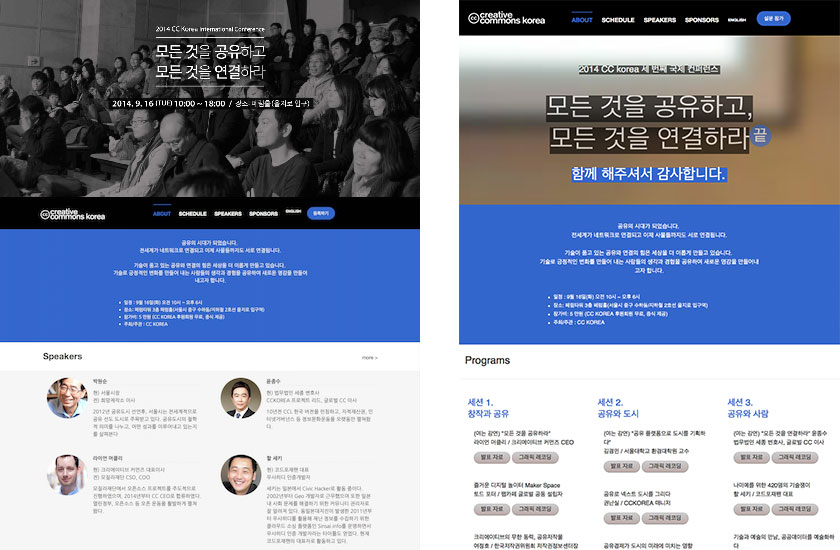

# 2014 CCKorea 세 번째 국제 컨퍼런스 웹사이트
Website for the thrid international conference of Creative Commons Korea in 2014


### 행사 개요 Event Outline

```
"모든 것을 공유하고 모든 것을 연결하라."
기술로 긍정적인 변화를 만들어 내는 사람들의 생각과 경험을 공유합니다.
2014년 9월 16일 10~18시, 페럼홀(을지로 입구)

"Share Everything, Connect Everything"
Share fresh inspirations from people whose efforts are bringing positive changes through technology.
16 SEP 2014, Ferrum Hall @ Seoul, South Korea"
```


### 사용법 How to use
[jekyll](https://github.com/jekyll/jekyll)이라는 static site generator를 사용합니다. 설치해야 합니다.
Requirement: [jekyll](https://github.com/jekyll/jekyll), famous static site generator.

```
cd cckcon3

bundle install
jekyll serve

(after bundle install, optionally can use grunt)
npm -g install grunt-cli
npm install
grunt serve

open http://localhost:4000
```


### 크레딧 Credits
```
청중 여러분, 연사 여러분, 후원사 여러분 감사합니다.
그리고 수많은 CCKorea 활동가들의 노고에 박수를!
마지막으로 CCKorea 후원자 여러분 감사드립니다.

Thanks for audience, speakers, sponsors.
And applause to a number of CCKorea activists!
At last, thanks for supporters of CC Korea.
```

[Skinny Bones Jekyll Starter](https://github.com/mmistakes/skinny-bones-jekyll)를 기반으로 이 웹사이트를 작성했습니다. Michael Rose님 땡유...
This webiste was written based on [Skinny Bones Jekyll Starter](https://github.com/mmistakes/skinny-bones-jekyll). Thanks, Michael Rose.


달리 정하지 않은 웹사이트의 모든 내용은 크리에이티브 커먼즈 저작자표시 2.0 대한민국 라이선스에 따라 이용할 수 있습니다.
자세한 이용기능 내용과 허락조건은 http://creativecommons.org/licences/by/2.0/kr 를 보세요.

Except where otherwise noted, contents on this site are licensed under a Creative Commons Attribution 2.0 Korea License.
See http://creativecommons.org/licences/by/2.0/kr for details.


MIT licensed...
